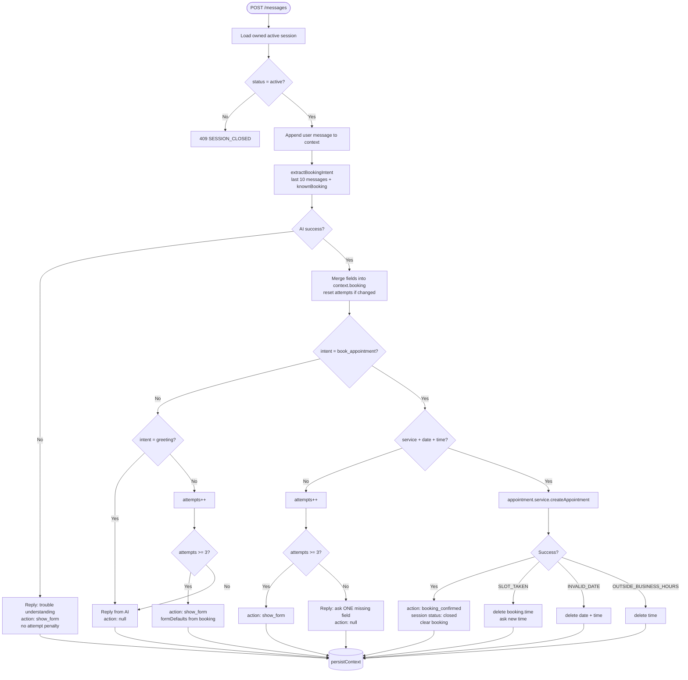

# BookWise — Architecture Deep Dive

Interview-oriented reference. All paths and behavior verified against the codebase.

---

## 1. Request lifecycle: chat message

```
Browser                    Express                      Services                    PostgreSQL / Mistral
   │                          │                             │                              │
   │ POST /api/chat/sessions  │                             │                              │
   │─────────────────────────>│ requireAuth                 │                              │
   │                          │ chat.controller             │                              │
   │                          │────────────────────────────>│ chat.closeActiveSessions     │
   │                          │                             │─────────────────────────────>│ UPDATE status=closed
   │                          │                             │ INSERT chat_sessions         │
   │                          │                             │─────────────────────────────>│
   │<─────────────────────────│ { data: { session, messages }}                             │
   │                          │                             │                              │
   │ POST .../messages        │                             │                              │
   │ { content }              │                             │                              │
   │─────────────────────────>│ requireAuth                 │                              │
   │                          │ chatLimiter (20/min)        │                              │
   │                          │ validate(sendMessageSchema) │                              │
   │                          │────────────────────────────>│ chat.handleUserMessage       │
   │                          │                             │ SELECT session (owner check) │
   │                          │                             │─────────────────────────────>│
   │                          │                             │ append user message          │
   │                          │                             │ businessService.getBusiness  │
   │                          │                             │ ai.extractBookingIntent      │
   │                          │                             │─────────────────────────────>│ Mistral API
   │                          │                             │ decision tree                │
   │                          │                             │ [maybe] appointment.create   │
   │                          │                             │─────────────────────────────>│ INSERT appointment
   │                          │                             │ UPDATE context (+ status)    │
   │                          │                             │─────────────────────────────>│
   │<─────────────────────────│ { data: { reply, action, ... }}                            │
   │                          │                             │                              │
   │ GET .../messages (poll)  │                             │                              │
   │─────────────────────────>│ every 3s from frontend      │                              │
```

**Frontend note:** Reply is available immediately from `POST` (optimistic user bubble + append assistant reply). Polling is a backup/sync mechanism; the primary path is synchronous HTTP.

---

## 2. Orchestrator decision tree



**Source:** `backend/src/services/chat.service.ts` — `handleUserMessage`, `MAX_ATTEMPTS = 3`.

---

## 3. AI service boundary

**File:** `backend/src/services/ai.service.ts`

| Does | Does not |
|------|----------|
| Build system prompt (date, services, hours, known booking) | Write to database |
| Call Mistral with `json_object` format | Create appointments |
| Sanitize intent, service_type, date, time, reply | Increment attempt counter |
| Log structured metadata | Choose show_form vs book |
| Return `{ success, data \| error }` | Handle SLOT_TAKEN |

**Prompt rules enforced in text:** ask exactly one missing field per turn; refuse off-topic in one sentence; use server "today" for relative dates.

**Sanitization examples:**

- Invalid intent → `'other'`
- Unknown service → `null`
- Date not matching `YYYY-MM-DD` → `null`
- 15s timeout → `{ success: false }`

---

## 4. Middleware order

**Global** (`backend/src/app.ts`):

```
1. trust proxy (1)     — Render/reverse proxy; fixes rate-limit X-Forwarded-For
2. cors                — FRONTEND_URL + localhost origins
3. requestLogger       — method, path, status, duration on response finish
4. express.json()
5. route handlers
6. 404 handler         — { error: NOT_FOUND }
7. errorHandler        — MUST be last
```

**Why `errorHandler` is last:** Express only forwards errors to error middleware if no response was sent. The 404 handler catches unmatched routes before the generic 500 handler. `errorHandler` maps:

- `AppError` → appropriate status + `{ error: { message, code, details? } }`
- Postgres `23505` → `409 DUPLICATE`
- Everything else → `500 INTERNAL_ERROR` + `console.error`

**Per-route stacks** (examples):

```
POST /auth/login     → authLimiter → validate(loginSchema) → login
POST /chat/.../messages → requireAuth → chatLimiter → validate → sendMessage
GET  /appointments   → requireAuth → listAppointments
```

**`requireAuth`:** reads `Authorization: Bearer`, verifies JWT with `JWT_SECRET`, attaches `req.user = { id, email, role }`.

---

## 5. Exclusion constraint + error mapping

**Schema** (`backend/src/db/schema.sql`):

```sql
CONSTRAINT no_overlapping_appointments EXCLUDE USING gist (
  business_id WITH =,
  tstzrange(starts_at, ends_at) WITH &&
) WHERE (status IN ('pending', 'confirmed'))
```

Requires `btree_gist` extension.

**Behavior:**

- Two active appointments at the same business cannot have overlapping `[starts_at, ends_at)` ranges.
- Cancelled/completed rows are **excluded** from the constraint → slot becomes available without DELETE.
- Concurrent inserts: one wins, other gets Postgres error code `23P01` (exclusion violation).

**Application mapping** (`appointment.service.ts` → `errorHandler`):

```typescript
// createAppointment catch
if (pgErr.code === '23P01') {
  throw AppError('Time slot is already booked', 409, 'SLOT_TAKEN');
}
```

No SELECT-for-update, no application-level lock. The database is the source of truth for concurrency.

---

## 6. Appointment validation pipeline

**File:** `backend/src/services/appointment.service.ts`

On `createAppointment(userId, input, bookedVia)`:

1. Resolve `durationMinutes` from `config/services.ts` by `serviceType`
2. Compute `ends_at = starts_at + duration`
3. `assertBookingRules(startsAt, durationMinutes)`:
   - Must be in the future
   - Weekday only (Mon–Fri)
   - Start/end within 09:00–17:00 **in the offset embedded in the ISO string**
4. `INSERT` with `DEFAULT_BUSINESS_ID`
5. Catch `23P01` → `SLOT_TAKEN`

**Cancel:** only `pending`/`confirmed`, owner check, `UPDATE status = cancelled`.

---

## 7. Chat session state (JSONB)

```typescript
interface ChatContext {
  messages: { role: 'user' | 'assistant'; content: string; at: string }[];
  booking: Record<string, unknown>;  // service_type, date, time, notes
  attempts: number;
}
```

**Session lifecycle:**

- `POST /chat/sessions` — closes all active sessions for user, inserts new with greeting
- Successful AI booking — `status: 'closed'`, `booking` cleared
- `POST /messages` on closed session — `409 SESSION_CLOSED`

---

## 8. Frontend architecture (summary)

| Concern | Implementation |
|---------|----------------|
| Auth gate | `RequireAuth` + `useAuthHydration` (wait for Zustand persist) |
| API client | `lib/api.ts` — attaches Bearer token from Zustand |
| Chat optimistic UI | `useSendMessage` onMutate adds user bubble before response |
| Chat input hidden | When `pendingAction.type === 'booking_confirmed'` |
| Booking form slots | `TIME_SLOTS` in `lib/appointments.ts` — 09:00–16:30, 30-min steps |
| Service display | Duration from API (`durationMinutes`); all services are 30 min |

---

## 9. AI prompt structure (summary)

System prompt includes:

1. Persona — booking assistant for `{businessName}`
2. Scope — appointments only; refuse off-topic briefly
3. `TODAY: {date} ({weekday}), timezone: {tz}`
4. Service list with IDs and durations
5. Business hours Mon–Fri 09:00–17:00, 30-minute slots
6. `ALREADY KNOWN booking fields: {JSON}`
7. Strict JSON output schema
8. Rule: one follow-up question per turn when fields missing

User/assistant turns: last 10 messages from session history.

---

## 10. File map (backend)

```
backend/src/
├── index.ts              entry, listen PORT
├── app.ts                middleware + route mounting
├── config/
│   ├── db.ts             pg Pool, ssl rejectUnauthorized: false
│   ├── env.ts            DEFAULT_BUSINESS_ID
│   └── services.ts       static catalog
├── middleware/
│   ├── auth.ts           JWT requireAuth
│   ├── validate.ts       Zod body parser
│   ├── rateLimit.ts      authLimiter, chatLimiter
│   ├── errorHandler.ts
│   └── logger.ts
├── routes/               thin routers
├── controllers/          HTTP in/out
├── services/
│   ├── auth.service.ts
│   ├── appointment.service.ts
│   ├── chat.service.ts   orchestrator
│   ├── ai.service.ts     Mistral only
│   └── business.service.ts
├── schemas/              Zod
└── db/
    ├── schema.sql
    └── seed.sql
```
